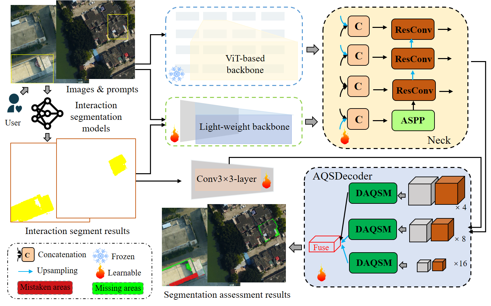
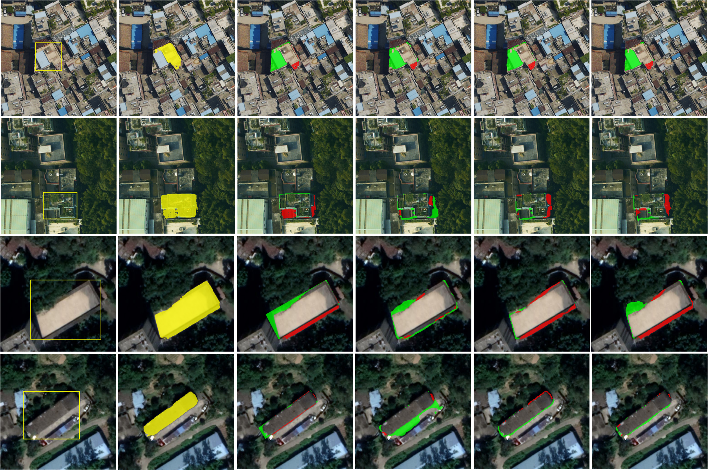

# The work of IBS-AQSNet 

## Title of paper to be published

Enhanced Automated Quality Assessment Network for Interactive Building Segmentation in High-Resolution Remote Sensing Imagery

## 1. Brief description of the proposed method
This study introduces the IBS-AQSNet, a network designed for interactive building segmentation quality assessment (SQA)
in high-resolution remote sensing images. The proposed IBS-AQSNet integrates a powerful pretrained backbone network with
a lightweight correspondence network, facilitating efficient and comprehensive feature extraction.
This network employs a direct fusion approach for these features and incorporates a multi-scale differential quality assessment decoder,
adept at identifying errors in SQA results, including missed and mistaken areas.

     
    Fig.1. The flowchart of the proposed IBS-AQSNet

## 2. Experimental results
The proposed method effectively addresses the challenge of building segmentation quality assessment. 
Experimental validation on the newly built EVLab-BGZ dataset confirms that the IBS-AQSNet excels in the building SQA task, 
representing a progression in remote sensing image analysis. 

     
     
    Fig.2. IBS-AQSNet performance visualization on EVLab-BGZ under different experimental setups. (a) images & prompts, (b) interactive segmentation results, 
(c) SQA ground truth, (d) Baseline, (e) Baseline with PIF, (f) Baseline with PIF and AQSD.Key:PIF (using pre-trained image features from SAM-b’s backbone);
Red for mistaken areas, Green for missed areas.

## 3. Experimental data and download address
*  EVLab-BGZ dataset: [EVLab-BGZ](https://pan.baidu.com/s/1UaqAjwr1-suXNk4J7wNdZg ) (Extraction code:EVLa)

This dataset comprises 2,825 aerial images and 1,006 satellite images, each with a resolution of 512×512 pixels. 
It encompasses a total of 39,198 instances of buildings. Each building is individually annotated, with rare instances 
of multiple buildings annotated together. The dataset features significant variation in building density, 
ranging from a single building to as many as 51 buildings per image, with each building occupying over 2,500 pixels. 
The dataset is divided into two subsets: 3,000 images for training and 831 images for testing.

## 4. Integrated Interactive segmentation software and demo effect

    <video width="720" height="480" autoplay>
        <source src="figures/demo.mp4" type="video/mp4">
        Your browser does not support the video tag.
    </video>

The demo video demonstrates the following steps:

1. **Interactive Segmentation of a Building Target:** 
    A process where the user directly interacts with the software to segment a building.

2. **Heuristic Automatic Detection of Buildings:** 
    An automated method using heuristic techniques to identify buildings in an image.

3. **Automatic Quality Assessment of Interactive Building Segmentation:** 
    An automated process that evaluates the quality of the segmentation performed in step 1.  
    - Note: Each interactive building segmentation result is given 2 seconds for automatic quality assessment, 
      to dynamically display the automatic quality control effect.
4. **Manual Interaction to Modify Certain Results:** 
    The user manually adjusts or corrects the segmentation results where necessary.

